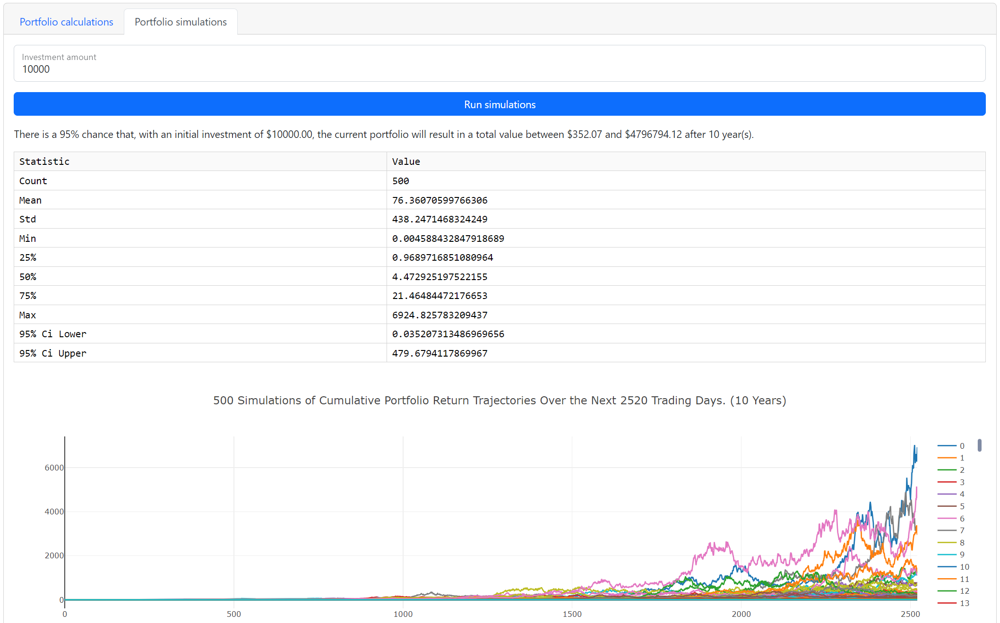

  
---
A Dash web-application designed for  

- managing personal investments;  
- planning and simulating theoretical portfolios;  
- predicting market data;  
- backtesting trading strategies;  
- determining personal risk tolerance;
- trading market assets.

# Project details
## Description and purpose
Investor's Dream is a web application that provides users a multitude of investment tools, including:  

- A summary of current investments held in multiple exchanges.
- A portfolio planner for analyzing and simulating theoretical portfolios.
- A market predictor for viewing potential market movement.
- A set of trading strategies along with a tool for backtesting the strategies.
- An interface for buying or selling market assets through a connected exchange.

Current investments are downloaded from an exchange's server via the exchange's API and displayed in the application. Users can draft and analyze theoretcial portfolios utilizing a variety of graphical and tabular methods. Drafted portfolios can be saved to the application's PostgreSQL database. Simulations can be performed on theoretical portfolios and analyzed in tabular and/or graphical formats.

    
## Questions
1. ~~How can an investor compare multiple simulated portfolios to determine their ideal investment portfolio?~~ *Answered in Project 1*
2. ~~How can an investor make the most money with the least amount of risk?~~ *Answered in Project 1*
3. ~~Which asset mix can provide the strongest portfolio given current market conditions?~~ *Answered in Project 1*
4. ~~In what ways can an investor visualize their investment planning data?~~ *Answered in Project 1*
5. ~~Who could use this application?~~ *Answered in Project 1*
6. ~~How can we diversify an investor’s portfolio such that it can be profitable and have stocks with a security worth investing in?~~ *Answered in Project 1*
7. ~~How do we present information to an investor looking to diversify their stock portfolio and maximize their profits such that they can study the information and make an informed decision before investing?~~ *Answered in Project 1*
8. What are the potential returns for the user?
9. What is the user's risk tolerance?
10. How can the user be kept in the loop?

## Answers
### Market predictor
  
The market predictor module utilizes a Neural Networks machine-learning model to predict future market data. The recurrent neural network LSTM (Long Short-Term Memory) is used for stock price prediction. The model learns patterns and relationships in historical stock price data to forecast future prices (one day after). With memory cells that store information over extended periods, LSTM networks capture long-term dependencies and temporal relationships. By processing past stock prices through multiple layers of LSTM cells, the model generates predictions.  

### Trading strategies
  
The trading strategy module currently offers users three algorithmic trading strategies, along with a tool to backtest the strategies on any asset of their choosing. Current strategies include
  
- GRID
  - GRID trading strategy is a systematic trading approach that involves placing buy and sell orders at predetermined price levels in a grid-like pattern, aiming to profit from price fluctuations within a specific range. The GRID strategy offers users a tool for arbitrage trading based on following the stock price, aiming to achieve higher returns than simply buying and holding a stock while reducing volatility risk.
- MACD
  - MACD line crosses above the signal line, it generates a bullish signal, indicating a potential buying opportunity. Conversely, when the MACD line crosses below the signal line, it generates a bearish signal, indicating a potential selling opportunity.
- TRIX
  - TRIX line is by applying the triple exponential moving average to the price data. When the TRIX line crosses above the signal line, it suggests a bullish signal for potential buying opportunities. Conversely, when the TRIX line crosses below the signal line, it suggests a bearish signal for potential selling opportunities.

Upon backtesting a strategy, the application outputs a variety of evaluation metrics, including

- signal evaluation
  - entry and exit signals relative to the daily closing price
- trade evaluation
  - the strategy's cumulative returns over a given period
- portfolio evaluation
  - annualized return
  - cumulative returns
  - Sharpe ratio
  - Sortino ratio
  - success ratio
  
The module describes and optimizes these trading strategies using the Python language, visualizes them through various charts, and generates buy and sell signals; all to provide users with a better understanding of each strategy's methodology and accuracy. Users are also provided backtesting functionality to assess the profitability and risk level of different asset-strategy combinations, enabling them to choose their preferred trading strategy for a particular asset.

### Portfolio drafting and analysis
  
The portfolio planner module allows users to draft portfolios of their choosing and run calculations on historical data to determing portfolio risk. Calculations include:

- Sharpe ratio
- Beta
- Daily returns
- Cumulative returns
- Daily closing price

The application employs validation techniques to ensure accurate portfolio drafting and analysis. Drafted portfolios can be saved to the application's database for future reference and comparison.  

### Monte Carlo Simulation and analysis
  
For further analysis of a portfolio, a Monte Carlo simulation tool is provided. To analyze the results of a Monte Carlo simulation, financial analysts often use metrics such as Sharpe ratios, standard deviations, and correlations. The Sharpe ratio, for example, measures the excess return of a portfolio relative to the risk-free rate, divided by its standard deviation. The standard deviation measures the degree of variability of the portfolio's returns, while correlations measure the degree to which the returns of different assets move together. In finance, Monte Carlo simulations are often used to analyze the risk and return of a portfolio of assets. The technique involves creating a model of the portfolio that takes into account the historical performance of the assets, as well as their expected future returns, volatility, and correlations with one another.  

### Amazon Lex bot (robo-advisor)
  
As many potential users are not aware of their risk tolerance, the profile module provides a risk tolerance evaluation tool, utilizing Amazon's Lex bot service integrated with a machine-learning model (risk tolerance classifier). A user of this tool will be asked for the following metrics:

- Age
- Net worth
- Annual Income
- Marriage status
- Number of kids

These parameters are then transferred to the risk tolerance classifier for further processing.

### Risk tolerance classifier
  
The application is concerned with providing users as much information and value as possible, and bringing awareness to their own financial background is a wonderful way to start. The risk tolerance classifier utilizes a Gradient Boosting Classifier with Over-Sampler for its machine-learning model. The dataset selected to train and test the model is real data provided by the Federal Reserve, built from a "Survey of Consumer Finances" that contains highly relevant population demographics, including:

- Age
- Education
- Employment
- Income
- Kids
- Marriage status
- Net worth
- Quality of life
- Risk tendency
- Saving potential
- Spending potential

The dataset includes the True Risk Tolerance which was utilized as our y target to train the model and predict the Risk Tolerance Score. Risk Tolerance Scores include:

- 1 (very low risk)
- 2 (low risk)
- 3 (moderate risk)
- 4 (high risk)
- 5 (very high risk)

Prior to utilizing the Gradient Boosting Classifier with Over-Sampler, other machine-learning models were trained and tested, some also with an Over-Sampler. The other models used include:

- Random Forest Classifier
- Decision Tree Classifier
- SVC
- Neural Networks

After assessing confusion matrices, classification reports and accuracy metrics for each model, it was determined the best performing model was the Gradient Boosting Classifier. Metrics from the model can be found in the table below. The model was also chosen due to its capacity to assess the relationships of the features in a more granular scope, and is less prone to overfit new data.

|                | Precision | Recall | F1-score |
|:-------------- |:---------:|:------:|:--------:|
| Very low risk  | 0.96      | 0.89   | 0.93     |
| Low risk       | 0.84      | 0.93   | 0.88     |
| Moderate risk  | 0.89      | 0.89   | 0.89     |
| High risk      | 0.97      | 0.93   | 0.95     |
| Very high risk | 0.99      | 1.00   | 1.00     |
| -------------- | --------- | ------ | -------- |
| Accuracy       | -         | -      | 0.93     |

### Email bot
  
The application has an integrated email notification system that allows the server to send email messages to a user. One such use of this system is an email notification provided to a user with their risk tolerance after using our risk tolerance robo-advisor. As the product develops, the system will provide users with other notifications including:

- Activation and deactivation of trading strategies
- Market news and insights
- Market triggers
- Order status updates
- Personalized notifications and preferences
- Risk analysis and alerts
- Security and account protection
- Trade execution confirmation
- Trade settlement and account updates

The sophisticated email notification system is designed to maximize customer engagement and streamline communication channels. Central to its functionality is the seamless delivery of pertinent information directly to users, empowering them with vital insights for informed decision-making. As the application evolves, user experience will continue to be enhanced through the expansion of the system's capabilities.
Security is of utmost importance to users of all applications; by utilizing third-party services from trusted providers, the application can ensure it is always adhering to industry-leading protocols and standards of data security.

### Further information
For further information, please refer to our PowerPoint presentations for [project 1](miscellaneous/Investor's%20Dream%201.0%20FinTech%20Project%201.pptx) and [project 2](miscellaneous/Investor's%20Dream%202.0%20FinTech%20Project%202.pptx).

## Running the application
Version 2 of the application requires the use of a localhost Flask server, all documents within this repository, the necessary API credentials, and a PostgreSQL database designed according to [our schema](miscellaneous/database_schema.svg).

Version 1 of the application can still be found at the following url:
https://fintech1.richedev.com/

## Application walkthrough
Please refer to our [project walkthrough](project_walkthrough.md) for detailed instructions on how to use the application.

## Data conclusions
Investor's Dream provides investors with the tools they require to monitor existing investments, monitor their risk tolerance, make informed decisions regarding future investments, and process new investments.

## Resources and technology employed
  
- [CSS](https://drafts.csswg.org/)
- [JSON](https://www.json.org/)
- [HTML](https://html.spec.whatwg.org/)
- [Python](https://www.python.org/)
  - [APIs](https://www.ibm.com/topics/api)
    - [Alpaca](https://alpaca.markets/)
    - [Auth0](https://auth0.com/)
    - [Bitget](https://www.bitget.com/)
    - [KuCoin](https://www.kucoin.com/)
    - [Questrade](https://www.questrade.com/)
  - [Dash](https://plotly.com/dash/)
  - [Finta](https://github.com/peerchemist/finta)
  - [Flask](https://flask.palletsprojects.com/)
  - [Holoviews](https://www.holoviews.org/)
  - [Imbalanced-Learn](https://github.com/scikit-learn-contrib/imbalanced-learn)
  - [Keras](https://keras.io/)
  - [Matplotlib](https://matplotlib.org/)
  - [Monte Carlo simulator](https://www.investopedia.com/terms/m/montecarlosimulation.asp)
  - [Numpy](https://numpy.org/)
  - [Pandas](https://pandas.pydata.org/)
  - [Plotly](https://plotly.com/)
  - [Scikit-Learn](https://scikit-learn.org/)
  - [SQLAlchemy](https://www.sqlalchemy.org/)
  - [TA-Lib](https://github.com/ta-lib/ta-lib-python)
  - [Tensorflow](https://www.tensorflow.org/)
  - [Websocket](https://github.com/websocket-client/websocket-client)
  - [YFinance](https://github.com/ranaroussi/yfinance)
- [SQL](https://www.iso.org/standard/63555.html)
  - [PostgreSQL](https://www.postgresql.org/)

## Developers
- [Andrea Delgadillo Tomasevich](https://github.com/visionaryspirit)
- [Dmitry Chalganov](https://github.com/Imbadimasa)
- [John Yin](https://github.com/Ziqiangyin)
- [Julian Ritchey](https://github.com/julianritchey)
- [Wanlin Li](https://github.com/WanlinLi2021)
    
### *Make your dream a reality.*