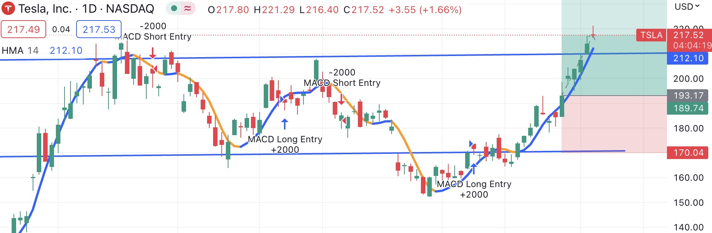
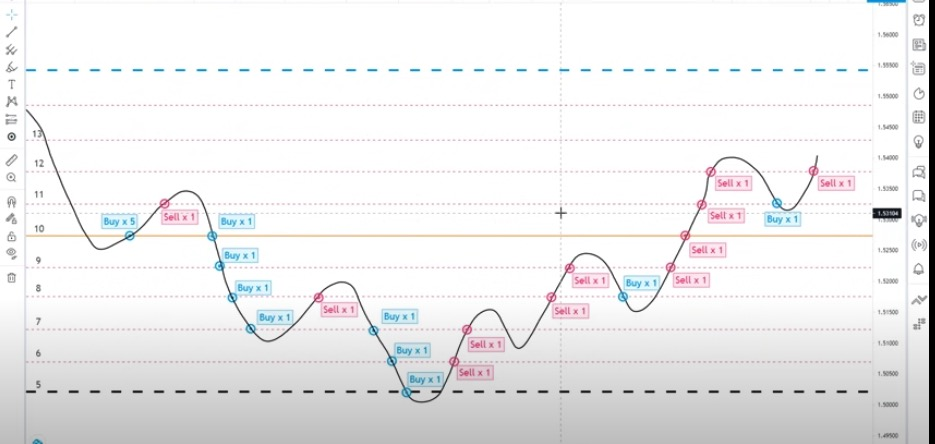

# Algo trading approach for individual investor

## What is the feature and what does it entail? (Purpose, usage, other details, etc.)
The Algo trading approach is utilized within the Investor's Dream app to execute trades for the stocks or cryptocurrencies selected by the investor. Its primary objective is to assist investors in identifying the best buying and selling points, reducing portfolio volatility, maximizing returns, and minimizing risk.

--------------------------------------------------------------------------

## Who does this feature target? (Audience, type of investor, etc.)
Our app aims to assist individual investors in overcoming emotional biases and cognitive errors, which are common challenges they face. Algo trading can effectively address these shortcomings. However, many individual investors lack coding knowledge and understanding of financial indicators, which hinders their ability to utilize algo trading approaches like institutional investors. Our app bridges this gap by providing a user-friendly interface that simplifies the trading process and enhances trade performance for individual investors.

--------------------------------------------------------------------------

## Where in the application should the feature be implemented? (Portfolio Planner, new page, etc.)
The application could be incorporated directly into the Investor's Dream app, providing users with an executive trading function.

--------------------------------------------------------------------------

## How will the feature be implemented? (Dependencies, APIs, UI, etc.)
1. Data Preparation: get the portfolio's stocks or cryptocurrency chosen by users from the Investor's Dream app.

2. Develop Algo trading function: MACD crossover trading strategy 
 

3. Develop trading logic function: base on grid trading method

  

4. APIs function: get historical data from the Alpaca stock dataset and Binance cryptocurrency dataset.

5. Backtest function: Backtest the algorithmic trading approach by different trading windows and trading regime.

6. Paper trading: use the algo trading model deal with paper trading.

7. Live trading: establish connection with outsider broker's trading platform, such as Alpaca or interactive.
