# Project walkthrough
Details for application usage.

## Getting started
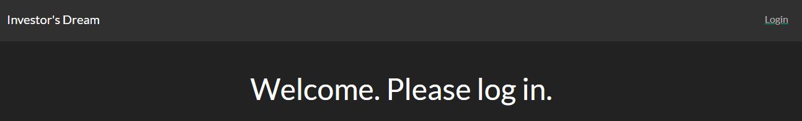  
Users begin by navigating to the following web address:  
[https://fintech1.richedev.com](https://fintech1.richedev.com)  
The home page of the application provides users a login link in the top-right corner. Users are required to log in.

## Logging in
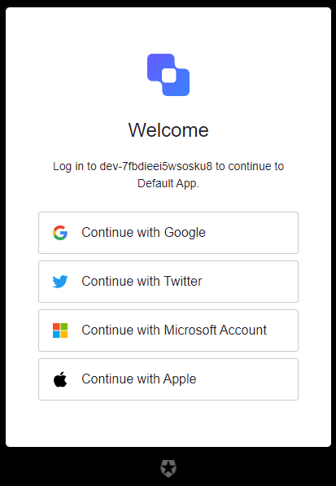  
The application utilizes a social login service provided by [Auth0](https://auth0.com/). Users are requested to log in using one of the social methods provided.

## Current investments
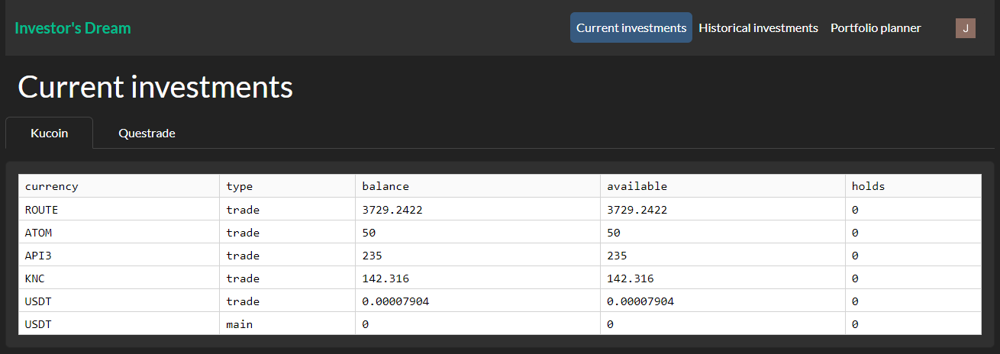  
Upon logging-in, users are brought to the *Current investments* screen where, if applicable, their current investments are displayed. A tabbed view allows users to view their current investments across multiple exchanges.

## Historical investments
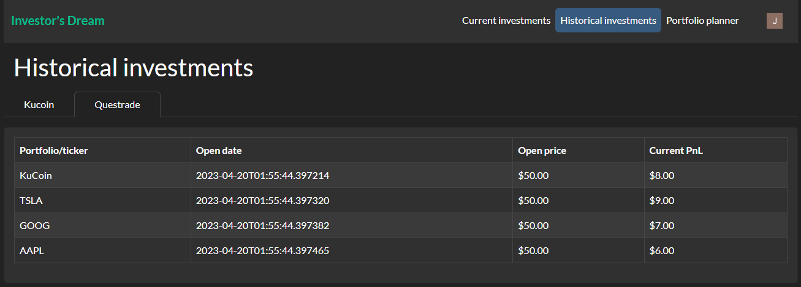  
The *Historical investments* screen displays users' historical investment data, if applicable. A tabbed view allows users to view their historical investments across multiple exchanges.

## Portfolio planner

The *Portfolio planner* screen provides users with a tool to draft and analyze new portfolios. Drafted portfolios must contain a name, an investment period, at least one ticker, and a total ticker weight equaling 1 across all tickers before it can be saved to the application's database.
  
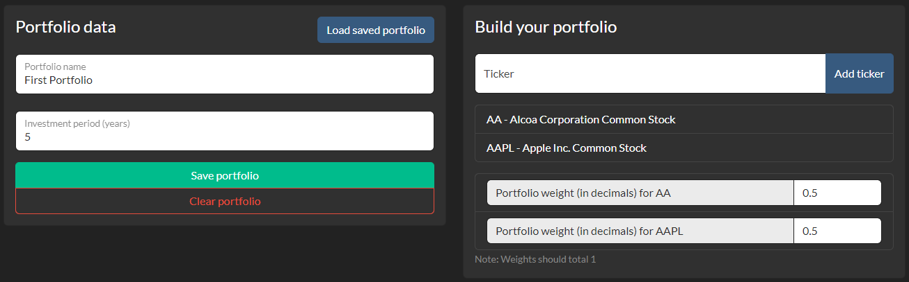  
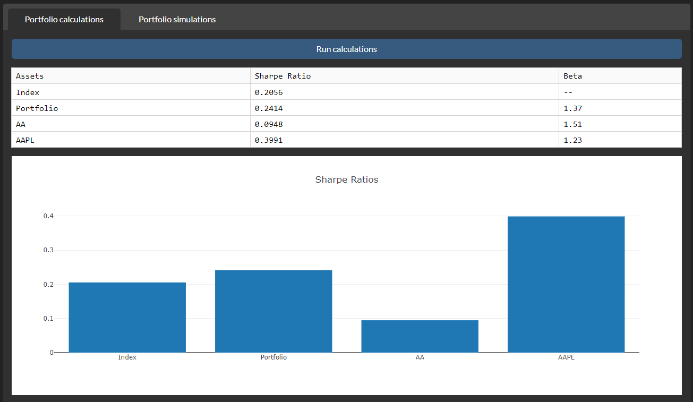  
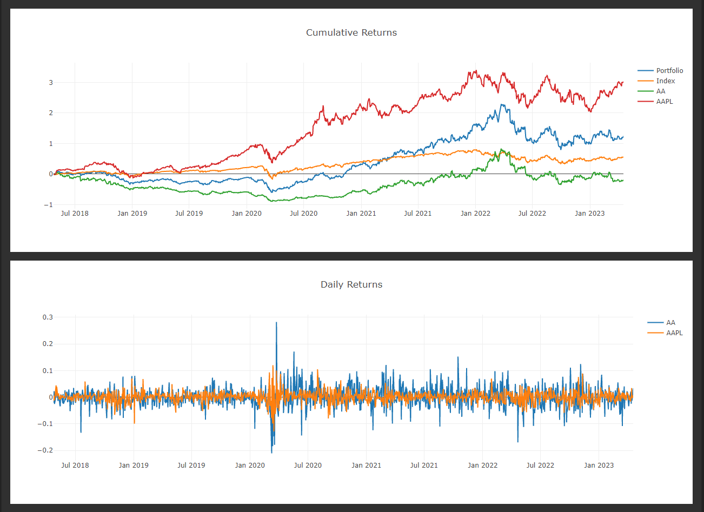  
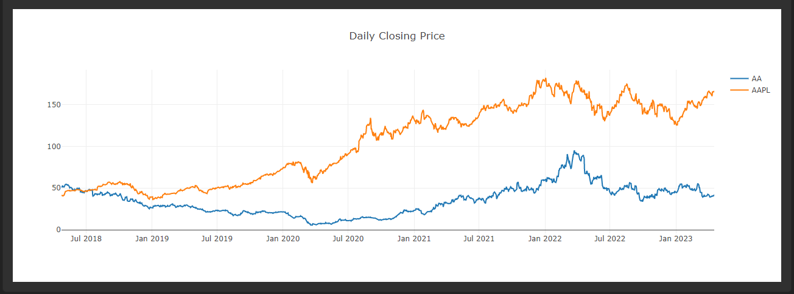  
Upon drafting a portfolio, users can run calculations to analyze historical portfolio performance and related statistics, including:
- Sharpe ratio
- Beta
- Daily returns
- Cumulative returns
- Daily closing price
  
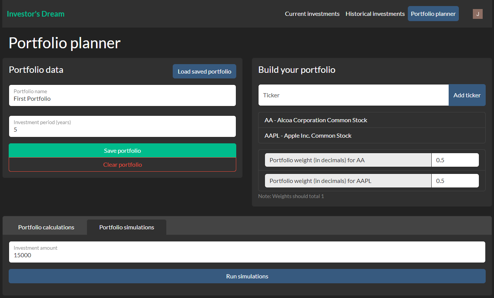  
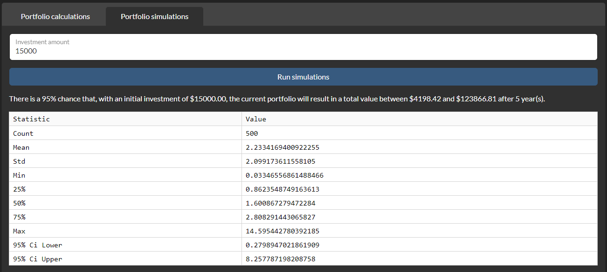  
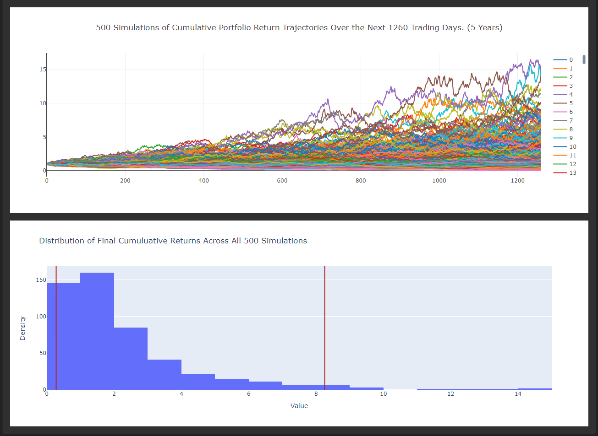  
By including an investment amount with a drafted portfolio, users can also run simulations to analyze theoretical future performance of the portfolio with statistics such as:
- Mean
- Standard deviation
- Quartiles
- 95% CI lower
- 95% CI upper
- Cumulative return trajectories
- Distribution of final cumulative returns

## Account management
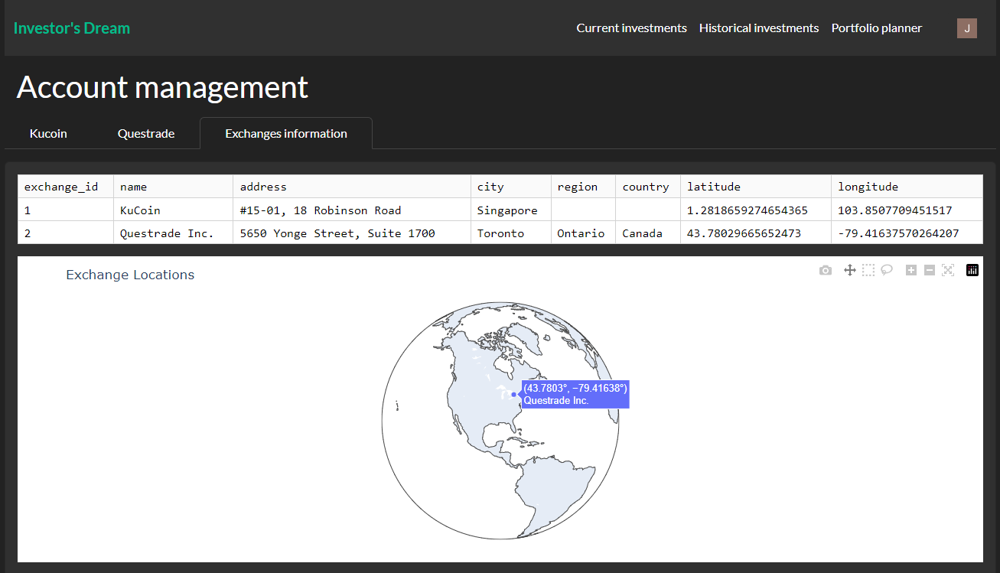  
The *Account management* screen allows users to view their connected exchanges, along with information relating to the exchanges.

## Logging out
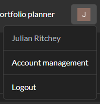  
For the privacy of personal information, users are encouraged to log out when not using the application.