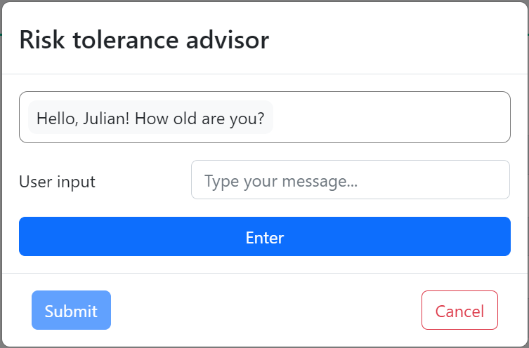

# Project walkthrough
Details for application usage.

## Getting started
   
The home page of the application provides users both a sign-up link (middle-left) and a login link (top-right). Users are required to sign up or log in. At this time, signing up and logging in perform the same action.

## Logging in

  
   

  
The application utilizes a social login service provided by [Auth0](https://auth0.com/). Users are requested to log in using one of the social methods provided.

## Dashboard
  
Upon logging-in, users are brought to the *Dashboard* page where, if applicable, their current investments are displayed. An accordion display in the *Summary* subpage allows users to view their current investments across multiple exchanges. Alternatively, users may view their investments for a specific exchange by selecting that exchange in the navigation sidebar to the left.

## Portfolio planner
  
The *Portfolio planner* page provides users with a tool to draft and analyze new portfolios. Drafted portfolios must contain a name, an investment period, at least one ticker, and a total ticker weight equaling 1 across all tickers before it can be saved to the application's database.

#### Portfolio calculations
  
  
  
  
Upon drafting a portfolio, users can run calculations to analyze historical portfolio performance and related statistics, including:
- Sharpe ratio
- Beta
- Daily returns
- Cumulative returns
- Daily closing price

#### Portfolio simulations
  
  
By including an investment amount with a drafted portfolio, users can also run simulations to analyze theoretical future performance of the portfolio with statistics such as:
- Mean
- Standard deviation
- Quartiles
- 95% CI lower
- 95% CI upper
- Cumulative return trajectories
- Distribution of final cumulative returns

## Trading
  
The *Trading* page is where users will find useful trading features, such as:
- A market predictor
- A strategy evaluator
- A trading bot module

### Market predictor
  
  
The market predictor allows users to select an asset of their choosing, then run a Neural Networks machine-learning model to predict the next trading day's closing price. By default, the predictor utilizes the last 156 weeks (roughly, 3 years) of daily close price data for the asset selected.

### Strategy evaluator
  
  
  
  
  
The strategy evaluator allows users to select an asset and strategy of their choosing, then run a backtest on the combination to analyze the strategy's performance. The backtest will result in three evaluation criteria:
- Signal evaluation
- Trade evaluation
- Portfolio evaluation

At this time, the application provides users with three (3) strategies to choose from:
- GRID
- MACD
- TRIX

### Trading bot module
  
  
The trading bot module allows users to make trades through exchange accounts they have connected.

## Account
  
The *Account* page is where users will manage all aspects of their account.

### Connections
  
The *Connections* subpage allows users add connections to accounts that have with various exchanges, as well as view, edit and remove existing account connections. The subpage also provides information relating to the exchanges the user has connected.

#### Add connection
  
  
Users can begin the process of adding a connection by clicking the *Add connection* button on the left-hand side of the *Connections* subpage. In the resulting popup, users select an exchange from the provided droplist. After selecting an exchange, a form will appear allowing users to enter their API information for the account they hold with the exchange. Upon entering their API information, users can add the connection by clicking the *Add connection* button.

At this time, the application allows connections to the following exchanges:
- Alpaca
- Bitget
- KuCoin
- Questrade

#### Remove connection
  
  
Users can begin the process of removing a connection by clicking the edit icon in the connections table next to the connection they wish to remove. In the resulting popup, users continue the process by clicking the *Remove connection* button. After entering the required text in the resulting form, users can remove the connection by clicking the *Confirm removal* button.

### Profile
  
The *Profile* subpage allows users to view their connected social account, as well as evaluate their risk tolerance.

#### Risk tolerance
  
Users can change their risk tolerance by clicking the *Change* button to the right of their displayed risk tolerance.

#### Robo-advisor
  
  
The application provides a robo-advisor feature that can help users to determine their risk tolerance. Users can access this feature by clicking the link provided in the *Profile* subpage. In the resulting popup, users can obtain a suggested risk tolerance by answering the provided questionnaire. Upon receiving their suggested risk tolerance, users can close the popup and receive a transcript of the questionnaire by clicking the *Submit* button.

## Logging out
  
For the privacy of personal information, users are encouraged to log out when not using the application. Users can log out of the application by clicking the *Log out* link provided in the account submenu.